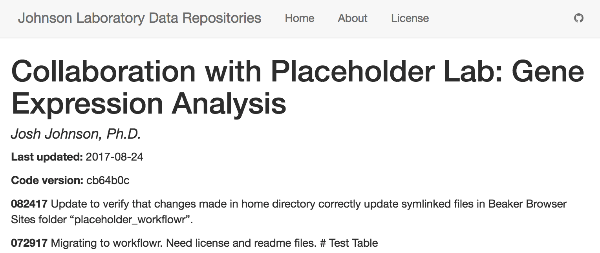

# One-way sharing of Rstudio output managed in Workflowr using Beaker Browser (UPDATE 082817)

UC-Denver bioinformaticist [Wladimir Labeikovsky](http://hslibraryguides.ucdenver.edu/prf.php?account_id=134943) pointed me to the super-useful [workflowr](https://github.com/jdblischak/workflowr) R package on GitHub. After successfully using workflowr on some test and some "real" Rmarkdown data analysis notebooks, I was looking for a way to share the beautiful .html output with collaborators.

## The Problem:

For labs like mine, hosting scientific data externally (e.g., on cloud hosts, including GitHub), can be fraught with problems. Academic institutions frown on the practice (for example, for intellectual property reasons), and their internal solutions can start and stop with shared drives and Dropbox/Dropbox-like alternatives. Of course, sharing non-hosted static web content with multiple .html pages, metadata, etc. is always a nightmare. I was stuck with exporting Rmarkdown documents to .pdf and emailing data to collaborators until my experience with workflowr\* UPDATE: Per @jdblischak, creation of a .PDF from a workflowr page can be accomplished directly by running the [rmarkdown](http://rmarkdown.rstudio.com/) function

    render("analysis/file.Rmd", pdf_document()).

I have verified that this works!

## The Solution-in-Progress

This is where [Beaker Browser](https://beakerbrowser.com/) came in. This unique browser allows website creation, cloning, modification, and publishing locally. After the site is ready, hitting "share" produces a unique [Dat project dat://](https://datproject.org/) hyperlink, *a la*

    dat://adef21aa8bbac5e93b0c20a97c6f57f93150cf4e7f5eb1eb522eb88e682309bc

This dat:// link can then be shared and the site opened *all the while being hosted locally on the site producer's machine.* Security is achieved with site encryption inherent in the Dat protocol (see "Security" on the [datproject docs page](https://docs.datproject.org/)), as well as the obscurity of the unique link.

OK, keeping up? So the question was whether workflowr-generated site content could easily be moved over to a Beaker Browser Site. **Initial results were promising,** as simply copying and pasting the workflowr output "docs" folder to a new Site worked flawlessly...locally. The Site, with its unique dat:// link rendered fine in Beaker Browser after import. But could this content be shared with others easily? I assumed that there would be such a thing as dat:// plugins for Chrome/Firefox, but no luck (See The Remaining Barriers, below).

After creating a new [workflowr Issue](https://github.com/jdblischak/workflowr/issues/59) laying out my needs, [@jdblischak](https://github.com/jdblischak) responded almost immediately. He pointed out a great symlink strategy to keep the Beaker Browser site up to date after workflowr "builds"; this again worked flawlessly. It was great to get feedback from Beaker Browser developer [@pfrazee](https://github.com/pfrazee) also.

## The Example Output

Here's that link again:

    dat://adef21aa8bbac5e93b0c20a97c6f57f93150cf4e7f5eb1eb522eb88e682309bc

In Beaker Browser, it should link to a Site called placeholder_workflowr, and clicking on "Placeholder Project" should show a nice workflowr Rmarkdown page of example "Reproducible Research" data:

## The Remaining Barrier(s)

The remaining issues are as follows. It is not clear that self-hosting is working yet, or, what download time is like for even the small example Placeholder Site hosted on my Mac laptop. What would download time be like for a larger multi-page data analysis? In the [workflowr Issue](https://github.com/jdblischak/workflowr/issues/59), @pfrazee pointed also to [hashbase.io](https://hashbase.io) (not favored due to off-site hosting) and the Beaker Browser subproject [dathttpd](https://github.com/beakerbrowser/dathttpd). The latter dathttpd example looks like it may be *perfect*, but will require more time and effort at my proficiency level.   

It would be great to just insist that collaborating scientists install Beaker Browser so that they can view our data, but that's not going to happen. For now, workflowr is an invaluable way to produce organized multi-page Reproducible Research static data websites, and I predict that Beaker Browser (or at least a mainstream browser plugin) will eventually meet our specific need of self-hosted, one-way sharing of Rstudio .html output.
